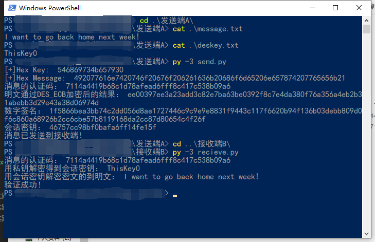

# AuthPrototype
A simple prototype user authentic system in Python3.
## Algorithm
- RSA
- SHA-1
- DES
## Usage
```bash
git clone https://github.com/spwpun/AuthPrototype.git
cd AuthPrototype/发送端A
# edit the message.txt and deskey.txt, but you can just input 8 ascii bytes in deskey.txt
python3 send.py
# then go back to B to recieve message
cd ../接收端B
python3 recieve.py
```
## Test



- - -
说明：
1.发送端有7个文件，deskey存放加密明文的对称密钥（8个字节），`A_D、A_N`,`B_E、B_N`文件分别存放A的私钥和B的公钥，message存放要发送的明文信息，send.py是执行发送过程的脚本；
2.接受端有6个文件，A_E、A_N、B_D、B_N文件分别存放A的公钥钥和B的私钥，r_message存放接受到的信息（包括消息认证吗、密文、数字签名、会话密钥），recieve.py是执行解密和验证过程的脚本；